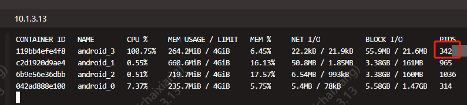

故障现象：
有好几台物理机上云机全部黑屏，不正常

异常点，
1. 大多数云机手动重启还黑屏不正常
必须重启物理机，所有的云机才恢复正常

2. 存在个别云机，手动重启，导致相邻云机恢复正常（极少）

收集文件
1. 故障云机重启全过程-logcat
2. 故障云机重启全过程内核-dmesg
2. 正常云机重启全过程内核-dmesg

我的思考
1. 一个物理机的共用linux内核，可能问题蔓延到内核
reboot一台云机，内核并没有重启，所以要重启物理机才有效

2. mali gpu报错 
mali fb000000.gpu: kbase KCPU [0000000000000000] delete fence signal timeout timer ret: 0